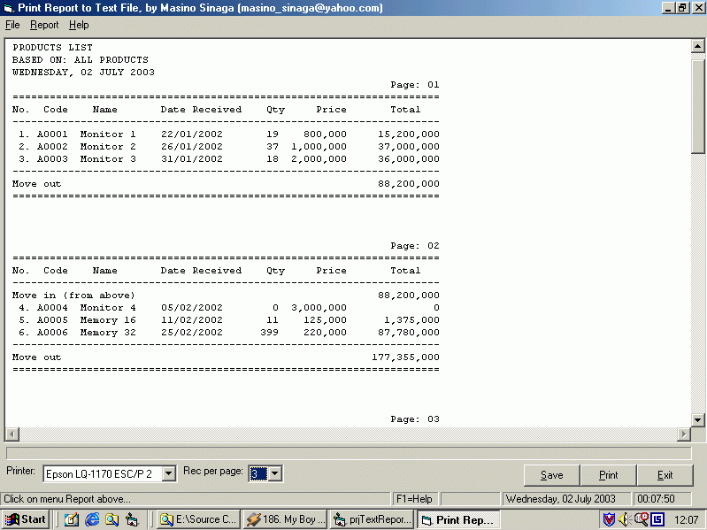



## Print Report to Text File and Printer

### Description

This project shows how we can print a very simple report to text file using RichTextBox control and to printer. The report contains simple information with quantity and sum of item per page, the sum of money per page, and total of sum of money in the end of report. User can select category to display the report. User also can change the number of record would be displayed in the screen/printer, and can change which printer will be used in combobox. The selected printer is the default installed printer in your computer. Including functions to adjust text-alignment in the report. This is very useful for you who want to print a simple report with many record to your screen and to your printer, without using the third party activex control. Any comments, feedback, and votes would be truly appriciated.
 
### More Info
 

             |
---                |---
**Submitted On**   |2003-07-04 17:59:54
**By**             |[Masino Sinaga](https://github.com/Planet-Source-Code/PSCIndex/blob/master/ByAuthor/masino-sinaga.md)
**Level**          |Beginner
**User Rating**    |4.3 (68 globes from 16 users)
**Compatibility**  |VB 6\.0
**Category**       |[Databases/ Data Access/ DAO/ ADO](https://github.com/Planet-Source-Code/PSCIndex/blob/master/ByCategory/databases-data-access-dao-ado__1-6.md)
**World**          |[Visual Basic](https://github.com/Planet-Source-Code/PSCIndex/blob/master/ByWorld/visual-basic.md)
**Archive File**   |[Print\_Repo160984742003\.zip](https://github.com/Planet-Source-Code/masino-sinaga-print-report-to-text-file-and-printer__1-46649/archive/master.zip)

